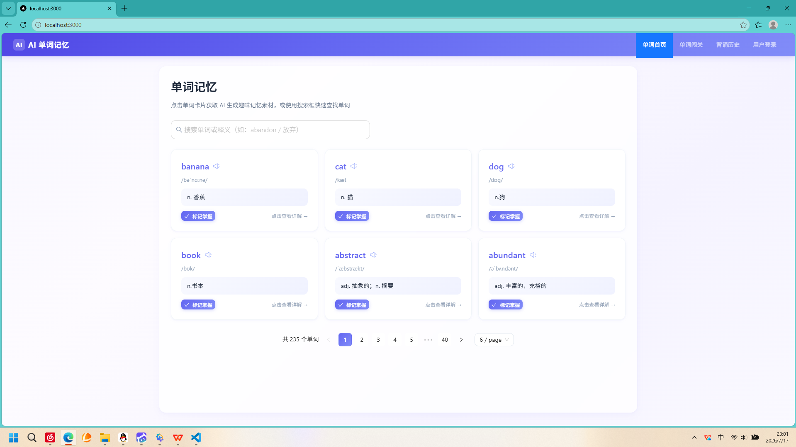
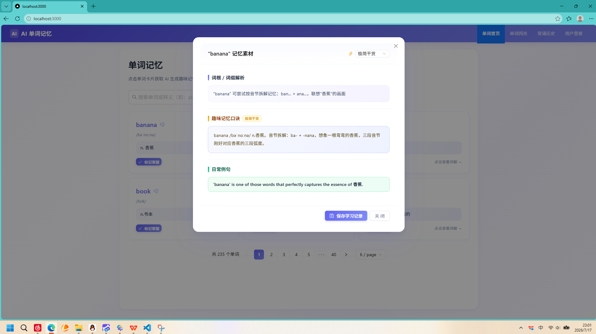
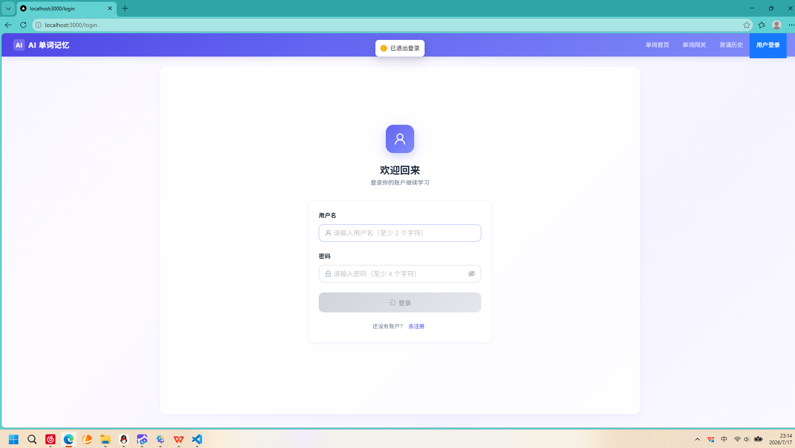
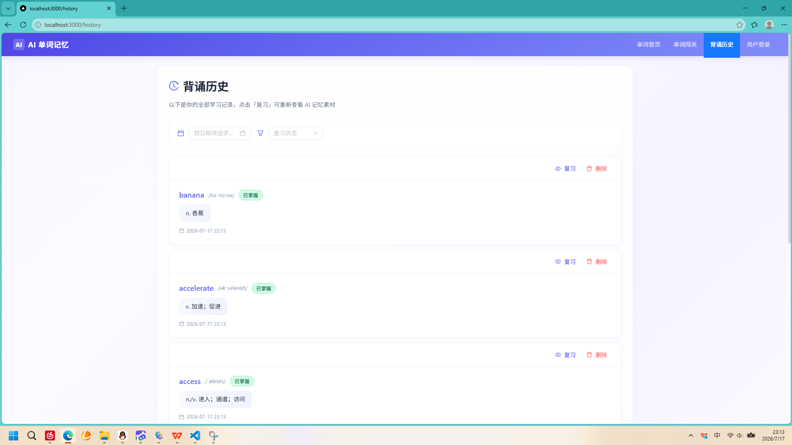
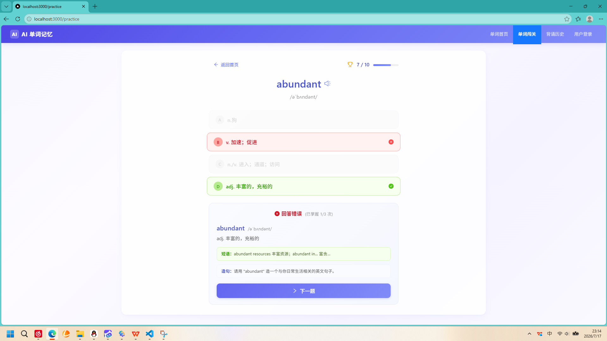

# AI 单词记忆 (AI Word Memory)

## 线上访问

| 服务 | 地址 |
|------|------|
| **前端页面** | [ai-word-memory-web-283624-5-1386564716.sh.run.tcloudbase.com](https://ai-word-memory-web-283624-5-1386564716.sh.run.tcloudbase.com) |
| **后端 API** | [ai-word-memory-api-283624-5-1386564716.sh.run.tcloudbase.com](https://ai-word-memory-api-283624-5-1386564716.sh.run.tcloudbase.com) |

> 部署平台：腾讯云 CloudBase 云托管（容器型服务）

---

基于 **Next.js + Flask + Supabase** 的全栈 AI 单词记忆 Web 应用，支持单词浏览、AI 趣味记忆素材生成、用户登录及学习记录管理。

---

## 技术栈

| 层级 | 技术 | 说明 |
|------|------|------|
| 前端框架 | Next.js 14 (Pages Router) | React 服务端渲染 |
| UI 组件库 | Ant Design 5 | 企业级 React UI |
| 后端框架 | Flask (Python 3.10+) | RESTful API |
| 数据库 | Supabase (PostgreSQL) | 云端托管数据库 |
| AI 模块 | 模拟 AI 引擎 (可扩展) | 词根解析 + 趣味口诀 + 例句生成 |

---

## 功能清单

### 单词首页 `/`
- 分页单词卡片展示（6/10/20 条可选）
- 顶部搜索框支持单词/释义模糊检索，实时刷新
- 每张卡片带复习状态切换按钮（待复习 / 已掌握）
- 点击卡片弹出 AI 记忆素材弹窗
- AI 弹窗分三区展示：词根解析、趣味记忆口诀、双语例句
- AI 请求超时倒计时 (30s) + 重试按钮
- 保存学习记录到个人中心
- 分页切换 300ms 防抖，避免重复请求
- 骨架屏加载动画 / 空数据提示 / 网络错误重试区域

### 用户登录 `/login`
- 用户名 + 密码登录，支持登录 / 注册切换
- 用户名实时长度校验（2~100 字符），密码长度校验（>4 位）
- 密码使用哈希存储，后端验证
- 登录成功 user_id 存入 localStorage，自动跳转首页
- 已登录状态展示 + 退出登录
- 未登录访问历史页 / 闯关页自动重定向登录页

### 背诵历史 `/history`
- 分页展示用户全部学习记录
- 日期筛选组件：按学习日期过滤记录
- 复习状态筛选：仅查看待复习 / 已掌握记录
- 点击「复习」重新打开 AI 记忆弹窗复习
- 学习记录删除功能（含确认弹窗）
- 分页切换防抖

### 单词闯关 `/practice`
- 四选一答题模式，每题带音标展示
- 答对变透明绿，答错红 + 绿高亮正确答案
- 答对 3 次标记掌握，优先推送尚未掌握的新词
- 进度显示 N/M，每 10 个里程碑弹窗提示
- 答完后浮现单词卡片复盘

### 全局特性
- 全局渐变纯色护眼背景（无外部图片）
- 移动端自适应适配（卡片铺满、分页换行、汉堡菜单）
- 统一错误 Toast 提示（showError / showSuccess / showWarning）
- `.env` / `.env.local` 密钥文件已被 `.gitignore` 拦截
- 统一返回格式 `{code, data, msg}`

---

## 环境配置

### 1. Supabase 配置

1. 注册 [Supabase](https://supabase.com)，创建项目
2. 进入 **Project Settings > API**，复制：
   - `Project URL`
   - `anon public key`
3. 在 **SQL Editor** 中执行 `database/init.sql` 创建数据表并导入测试数据

### 2. 后端 `.env` 配置

在 `backend/` 目录下创建 `.env` 文件：

```env
SUPABASE_URL=https://xxxxxxxxxxxx.supabase.co
SUPABASE_PUBLISHABLE_KEY=sb_publishable_xxxxxxxxxxxx
SUPABASE_SECRET_KEY=sb_secret_xxxxxxxxxxxx
FLASK_DEBUG=1
FLASK_HOST=0.0.0.0
FLASK_PORT=5000
```

> **密钥获取方式**：
> - `SUPABASE_URL` → Supabase 项目设置 → API → Project URL
> - `SUPABASE_PUBLISHABLE_KEY` → 同上页面 publishable key
> - `SUPABASE_SECRET_KEY` → 同上页面 secret key（需服务端使用，注意保密）

### 3. 前端 `.env.local` 配置

在 `frontend/` 目录下创建 `.env.local` 文件：

```env
NEXT_PUBLIC_API_BASE=http://127.0.0.1:5000
```

---

## 本地启动

### 后端启动

```bash
cd backend

# 安装依赖
pip install -r requirements.txt

# 启动 Flask（端口 5000）
python app.py
```

### 前端启动

```bash
cd frontend

# 安装依赖
npm install

# 启动 Next.js 开发服务器（端口 3000）
npm run dev
```

访问 **http://localhost:3000** 即可使用。

---

## 数据库说明

### 表结构

#### words（单词表）

| 字段 | 类型 | 说明 |
|------|------|------|
| id | SERIAL | 主键，自增 |
| word | VARCHAR(100) | 单词 |
| phonetic | VARCHAR(100) | 音标 |
| basic_meaning | TEXT | 中文释义 |
| review_status | INTEGER | 兼容旧字段，实际状态由 user_word_status 维护 |
| created_at | TIMESTAMP | 创建时间 |

#### user_word_status（用户-单词状态表）

| 字段 | 类型 | 说明 |
|------|------|------|
| id | SERIAL | 主键，自增 |
| user_id | INTEGER | 用户 ID（外键 → users） |
| word_id | INTEGER | 单词 ID（外键 → words） |
| review_status | INTEGER | 复习状态（0=待复习，1=已掌握） |
| updated_at | TIMESTAMP | 更新时间 |

> 不同用户的复习状态相互隔离，避免 A 用户标记掌握后 B 用户也显示已掌握。

#### users（用户表）


| 字段 | 类型 | 说明 |
|------|------|------|
| id | SERIAL | 主键，自增 |
| username | VARCHAR(100) | 用户名（唯一） |
| password_hash | VARCHAR(255) | 密码哈希 |
| created_at | TIMESTAMP | 创建时间 |

#### study_record（学习记录表）

| 字段 | 类型 | 说明 |
|------|------|------|
| id | SERIAL | 主键，自增 |
| user_id | INTEGER | 用户 ID（外键 → users） |
| word_id | INTEGER | 单词 ID（外键 → words） |
| study_date | TIMESTAMP | 学习日期 |

### RLS 权限说明

已在 `init.sql` 中配置完整的 Row Level Security (RLS) 策略：
- 所有表已启用 RLS
- 匿名用户可读（SELECT），写入操作由后端 `service_role` 控制
- 执行 `init.sql` 即可自动配置

---

## API 接口

| 方法 | 路径 | 说明 |
|------|------|------|
| GET | `/api/words?page=&size=&keyword=` | 分页单词列表（支持模糊搜索） |
| GET | `/api/words/:id` | 单词详情 |
| POST | `/api/words` | 新增单词（含查重） |
| PUT | `/api/words/:id/status` | 更新单词复习状态 |
| DELETE | `/api/words/:id` | 删除单词 |
| POST | `/api/ai/memo` | AI 生成记忆素材 |
| POST | `/api/user/register` | 用户注册 |
| POST | `/api/user/login` | 用户登录 |
| POST | `/api/study/add` | 新增学习记录 |
| GET | `/api/study/list?user_id=&page=&size=&date=&review_status=` | 分页查询学习记录（含日期/状态筛选） |
| DELETE | `/api/study/:id` | 删除学习记录 |

---

## Git 开发规范

### 提交前缀

| 前缀 | 用途 |
|------|------|
| `feat:` | 新功能 |
| `fix:` | Bug 修复 |
| `docs:` | 文档更新 |
| `refactor:` | 代码重构 |
| `chore:` | 构建/工具配置 |

### 本项目提交记录（最新）

```
ec758c2 docs: update README - remove screenshot placeholder, update project structure and commit log
1a50d3a docs: add demo video
58602f1 chore: remove vercel leftovers and update deployment description to CloudBase
f6f7481 fix: load all words (not just 10) and prioritize unseen words in practice
8a5222e fix: practice milestone counter resets to 0/10 after each batch of 10
0e07635 docs: move deployment URLs to top of README
cc2bd9b docs: add deployment URLs to README
69cd640 deploy: add frontend Dockerfile for CloudBase CloudRun
03efa23 deploy: point frontend API base to CloudBase backend
```

---

## 项目结构

```
ai-word-memory/
├── backend/                 # Flask 后端
│   ├── app.py               # 应用入口，注册蓝图
│   ├── config.py            # 配置管理
│   ├── Dockerfile           # CloudBase 云托管容器构建文件
│   ├── supabase_client.py   # Supabase 客户端
│   ├── seed_kaoyan_words.py # 考研词汇批量导入脚本
│   ├── requirements.txt     # Python 依赖
│   ├── .env                 # 环境变量（需自行创建，不提交）
│   ├── .env.example         # 环境变量模板
│   ├── utils/               # 工具函数
│   │   ├── auth.py          # 认证鉴权
│   │   └── response.py      # 统一响应格式
│   ├── wsgi.py              # WSGI 入口
│   └── routes/              # 接口路由
│       ├── __init__.py
│       ├── word.py          # 单词 CRUD
│       ├── ai_api.py        # AI 记忆素材
│       ├── practice.py      # 单词闯关记录
│       ├── user.py          # 用户登录/注册
│       └── record.py        # 学习记录
├── frontend/                # Next.js 前端
│   ├── Dockerfile           # CloudBase 云托管容器构建文件
│   ├── pages/               # 页面
│   │   ├── index.js         # 首页
│   │   ├── login.js         # 登录页
│   │   ├── history.js       # 背诵历史页
│   │   ├── practice.js      # 单词闯关页
│   │   └── _app.js          # 全局布局包裹
│   ├── components/
│   │   ├── Layout.js        # 全局布局组件（导航栏 + 页面容器）
│   │   └── AIMemoModal.js   # AI 记忆素材弹窗公共组件
│   ├── utils/
│   │   └── errorHandler.js  # 统一错误提示工具
│   ├── styles/
│   │   └── globals.css      # 全局样式
│   ├── public/              # 静态资源（favicon、SVG 图标）
│   ├── AGENTS.md            # CloudBase AI 配置
│   ├── CLAUDE.md            # CloudBase AI 配置
│   ├── package.json
│   ├── package-lock.json
│   ├── next.config.js
│   ├── next.config.mjs
│   └── .env.local.example   # 前端环境变量模板
├── database/
│   └── init.sql             # 数据库初始化 SQL
├── delivery/                # 交付文档
├── prompt-record/           # AI 开发 Prompt 截图归档
├── screenshots/             # 页面截图
├── 演示视频/                # 演示视频
│   └── video.mp4
├── API.md                   # 独立 API 接口文档
├── prompt_log.md            # 全部 Prompt 归档文档
├── task_record.md           # 每日开发任务记录
├── CODE_REVIEW_REPORT.md    # AI Code Review 报告
├── 个人实训总结报告.md       # 个人实训总结报告
├── 个人实训总结报告.docx     # 个人实训总结报告（Word 文档）
├── .gitignore
└── README.md
```

---

## 截图展示

| 页面 | 说明 |
|------|------|
|  | 单词卡片首页（渐变背景 + 搜索 + 复习标记） |
|  | AI 记忆素材弹窗（三区展示） |
|  | 用户登录/注册页（密码验证） |
|  | 背诵历史页（日期筛选 + 状态筛选） |
|  | 单词闯关页（四选一答题） |

---

**+ 仅供学习实训使用**

